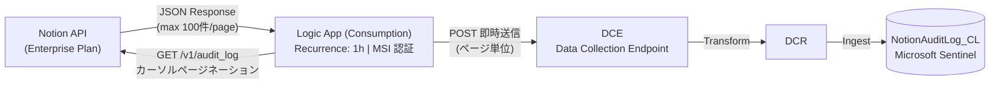

# Notion Audit Log → Microsoft Sentinel (Logic App)

Notion の [Audit Log API](https://developers.notion.com/reference/get-audit-log) から監査ログを自動取得し、Microsoft Sentinel の `NotionAuditLog_CL` カスタムテーブルへインジェストする Logic App (Consumption) ソリューションです。

## アーキテクチャ



## 特徴

| 特徴 | 詳細 |
|---|---|
| **ノーコード** | Logic App のビジュアルデザイナーで構築。コーディング不要 |
| **ページ単位即時送信** | 100 件ごとに DCE へ即時 POST。全件蓄積しないためメモリ効率に優れる |
| **MSI 認証** | System-assigned Managed Identity で DCE 認証。シークレット管理不要 |
| **超低コスト** | Consumption 従量課金で月額 **~$5 以下** |
| **リソース最小構成** | Logic App + DCE + DCR の **3 リソースのみ** |

## 前提条件

### Notion

- **Enterprise プラン**（Audit Log API は Enterprise 限定）
- `Read audit logs` 権限を持つ Internal Integration Token

### Azure

- Azure サブスクリプション（Contributor + User Access Administrator / Owner）
- Sentinel が有効化された Log Analytics ワークスペース
- Azure CLI v2.60 以上
- PowerShell 5.1 以上

> **リージョン制約**: DCE / DCR は Log Analytics ワークスペースと**同じリージョン**に配置する必要があります。

## ファイル構成

```
├── params.json                              # パラメータテンプレート（最初にこれを編集）
├── deploy.ps1                               # ワンクリック展開スクリプト
├── ISS-046_deploy.bicep                     # DCE + DCR をデプロイ
└── ISS-046_logic_app_consumption.json       # Logic App (Consumption) ARM テンプレート
```

## デプロイされるリソース

### Bicep (DCE + DCR)

| # | リソース種類 | 名前パターン | 目的 |
|---|---|---|---|
| 1 | Data Collection Endpoint (DCE) | `{baseName}-dce-{suffix}` | ログ受信エンドポイント |
| 2 | Data Collection Rule (DCR) | `{baseName}-dcr-{suffix}` | スキーマ定義・ルーティング |

### ARM テンプレート (Logic App)

| # | リソース種類 | 名前 | 目的 |
|---|---|---|---|
| 1 | Logic App (Consumption) | `{baseName}` | ワークフロー実行基盤（MSI 付き） |

### RBAC (deploy.ps1 で割り当て)

| ロール | 対象 | スコープ |
|---|---|---|
| Monitoring Metrics Publisher | Logic App MSI | DCR |

## クイックスタート

### 1. パラメータファイルの編集

`params.json` を開き、環境情報を記入します。

```json
{
  "azure": {
    "subscriptionId": "xxxxxxxx-xxxx-xxxx-xxxx-xxxxxxxxxxxx",
    "resourceGroupName": "Notion-Audit-RG",
    "location": "japaneast"
  },
  "sentinel": {
    "workspaceResourceId": "/subscriptions/xxx/.../workspaces/xxx"
  },
  "notion": {
    "integrationToken": "secret_XXXXXXXXXXXX...",
    "apiBaseUrl": "https://api.notion.com"
  },
  "options": {
    "baseName": "notion-audit-la"
  }
}
```

> `location` は Sentinel ワークスペースと**同じリージョン**を指定してください。異なるリージョンの場合、DCR デプロイが失敗します。

### 2. 自動デプロイの実行

```powershell
az login
az account set --subscription "<SUB_ID>"
cd LogicApps
.\deploy.ps1
```

スクリプトが以下を自動実行します:

| Step | 内容 |
|---|---|
| 0 | Azure CLI ログイン確認 |
| 1 | リソースグループ作成 |
| 2 | Bicep デプロイ (DCE + DCR) |
| 3 | Logic App (Consumption) ARM デプロイ |
| 4 | RBAC 割り当て (Monitoring Metrics Publisher) |
| 5 | Logic App 有効化 |
| 6 | 動作確認（初回実行の成否を確認） |

> 既にログイン済みの場合: `.\deploy.ps1 -SkipLogin` でログインステップをスキップできます。

### 3. Notion Integration Token の作成

1. [https://www.notion.so/my-integrations](https://www.notion.so/my-integrations) にアクセス
2. 「+ New integration」→ Integration name を入力
3. Associated workspace を選択 → Submit
4. **Capabilities** タブ → 「**Read audit logs**」にチェック → Save changes
5. **Secrets** タブ → Token をコピー

> ⚠ Token は一度しか完全に表示されません。

## 手動デプロイ

自動デプロイを使わない場合、各ステップを個別に実行できます。

### リソースグループ作成 & Bicep デプロイ

```powershell
az group create --name Notion-Audit-RG --location japaneast

az deployment group create `
  --resource-group Notion-Audit-RG `
  --template-file ISS-046_deploy.bicep `
  --parameters sentinelWorkspaceResourceId="<WORKSPACE_RESOURCE_ID>"
```

### Logic App のデプロイ

Bicep デプロイの出力値 (`dceEndpoint`, `dcrImmutableId`) を使用します。

```powershell
az deployment group create `
  --resource-group Notion-Audit-RG `
  --template-file ISS-046_logic_app_consumption.json `
  --parameters `
    logicAppName="notion-audit-la" `
    notionApiBaseUrl="https://api.notion.com" `
    notionToken="<NOTION_INTEGRATION_TOKEN>" `
    dceEndpoint="<DCE_ENDPOINT>" `
    dcrImmutableId="<DCR_IMMUTABLE_ID>"
```

### RBAC 割り当て

```powershell
az role assignment create `
  --assignee-object-id "<LOGIC_APP_PRINCIPAL_ID>" `
  --assignee-principal-type ServicePrincipal `
  --role "3913510d-42f4-4e42-8a64-420c390055eb" `
  --scope "<DCR_RESOURCE_ID>"
```

> RBAC の反映には最大 5 分かかります。

### Logic App の有効化

デプロイ直後は Disabled 状態です。RBAC 割り当て後に有効化:

```powershell
az rest --method post `
  --url "https://management.azure.com/subscriptions/<SUB_ID>/resourceGroups/<RG_NAME>/providers/Microsoft.Logic/workflows/<LOGIC_APP_NAME>/enable?api-version=2019-05-01"
```

## 動作確認

### Logic App 実行履歴

Azure Portal → Logic App → 「実行の履歴」で最新実行が「成功」であることを確認。

### KQL でデータ到達確認

```kusto
NotionAuditLog_CL
| where TimeGenerated > ago(1h)
| summarize Count = count() by EventCategory, EventType
| order by Count desc
```

> DCE → テーブルへのインジェストには最大 5〜10 分の遅延があります。

## トラブルシューティング

| 症状 | 原因 | 対処 |
|---|---|---|
| Bicep デプロイ失敗 `InvalidWorkspace` | DCR と Log Analytics WS のリージョン不一致 | RG リージョンを Sentinel WS と同じリージョンに変更 |
| Logic App 実行が Failed | Notion API / DCE 認証エラー | 実行詳細で失敗アクションのエラーメッセージを確認 |
| Notion API 401 | Token が無効/期限切れ | Token を直接テスト（下記参照） |
| Notion API 403 | Enterprise プラン以外 or Audit Log 権限なし | Notion 管理画面でプラン + Integration の Capabilities を確認 |
| DCE POST で 403 | RBAC 未反映/不足 | MSI に Monitoring Metrics Publisher を確認。割り当て後 5 分待つ |
| データが来ない | インジェスト遅延 | 最大 10 分待ってから KQL で再確認 |

### Notion Token テスト

```powershell
Invoke-RestMethod -Uri "https://api.notion.com/v1/audit_log?page_size=1" `
  -Headers @{
    "Authorization" = "Bearer <NOTION_TOKEN>"
    "Notion-Version" = "2022-06-28"
  }
```

## コスト目安

| リソース | 課金モデル | 月額目安 |
|---|---|---|
| Logic App (Consumption) | 実行ごとの従量課金 | $1〜$5 |
| DCE / DCR | 無料 | $0 |
| **合計** | | **~$5/月以下** |

> - トリガー実行: $0.000025/回（1時間1回 = 720回/月 ≈ $0.02）
> - アクション実行: $0.000125/回（ページネーション + DCE POST × ページ数）
> - Log Analytics インジェスト課金 ($2.76/GB) は別途

## アンインストール

```powershell
az group delete --name Notion-Audit-RG --yes --no-wait
```

## Notion Audit Log API 仕様準拠

| 仕様項目 | 公式仕様 | 本ツール |
|---|---|---|
| エンドポイント | `GET /v1/audit_log` | ✓ |
| 認証方式 | `Authorization: Bearer {token}` | ✓ |
| API バージョン | `Notion-Version: 2022-06-28` | ✓ |
| ページネーション | カーソルベース | ✓ |
| レートリミット | 3 req/sec, 429 + Retry-After | ✓ |
| イベントカテゴリ | 5 カテゴリ | ✓ |

## ライセンス

MIT
